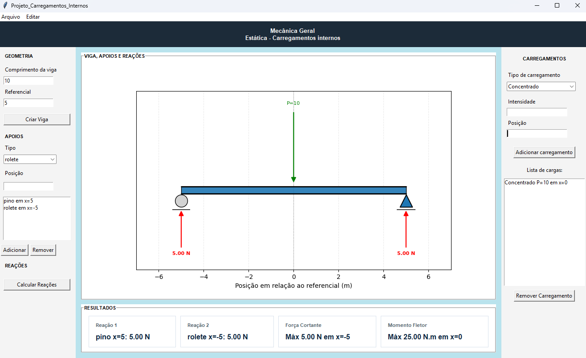
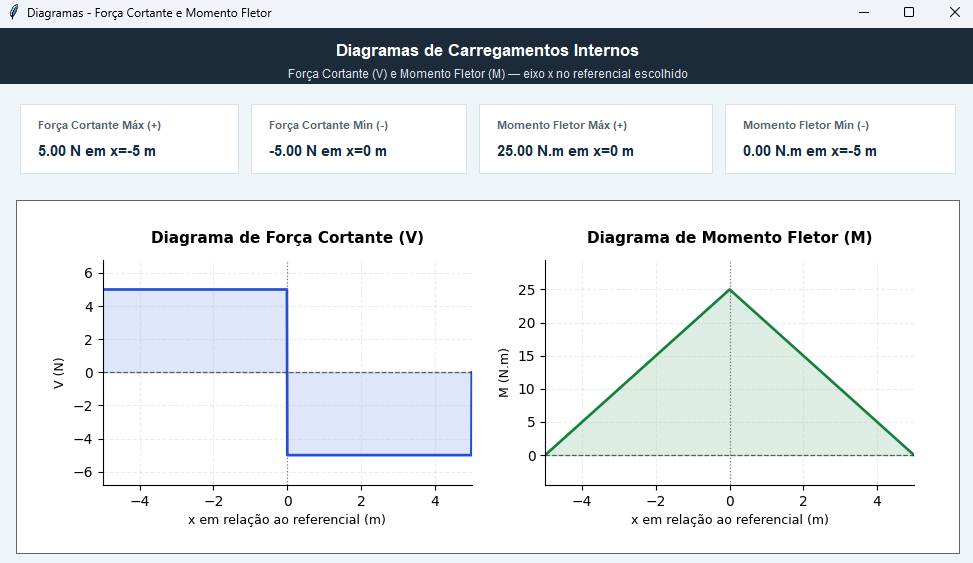

# Carregamentos Internos em Vigas

## Descrição
Aplicação desenvolvida para análise de vigas submetidas a diferentes tipos de carregamentos, com cálculo de:

- Reações nos apoios
- Força cortante (V)
- Momento fletor (M)
- Diagramas V(x) e M(x)

O projeto segue os princípios da disciplina de Resistência dos Materiais, utilizando o método das seções para determinação dos esforços internos.

---

## Objetivo
Atender ao trabalho proposto pelo professor, que exige o desenvolvimento de um sistema capaz de:

- Modelar uma viga com diferentes apoios
- Inserir carregamentos variados
- Calcular esforços internos
- Exibir diagramas de forma gráfica

---
## Interface
<p align="center">  </p>
A interface permite configurar a geometria da viga, selecionar os tipos de apoio e inserir diferentes tipos de carregamentos, apresentando posteriormente os resultados de forma gráfica.

<p align="center">  </p>

---

## Funcionalidades

### 🔹 Entrada de dados
- Comprimento da viga
- Referencial
- Tipos de apoio:
  - Pino + rolete
  - Engaste

### 🔹 Carregamentos suportados
- Força concentrada
- Carga distribuída constante
- Carga distribuída linear
- Momento concentrado

### 🔹 Processamento
- Validação da estrutura
- Cálculo das reações
- Cálculo de V(x) e M(x)
- Geração de diagramas

### 🔹 Saída gráfica
- Desenho da viga com apoios e cargas
- Diagrama de força cortante
- Diagrama de momento fletor

---

## Estrutura do Projeto


```text
Carregamentos_Internos/
│
├── main.py
│
├── interface/
│   ├── janela.py
│   ├── elementos.py
│   ├── graficos.py
│
├── logica/
│   ├── Viga.py
│   ├── apoios/
│   ├── carregamentos/
│   ├── calculos/
│   └── operacoes/
```


### Principais módulos

- **Viga.py** → núcleo da aplicação
- **calculos/** → implementa estática (∑F, ∑M, diagramas)
- **carregamentos/** → modelagem das cargas
- **apoios/** → tipos de apoio
- **interface/** → GUI e visualização

---

## Fundamentos Teóricos

O projeto utiliza:

- Equilíbrio estático:
  - ∑F = 0
  - ∑M = 0

- Relações fundamentais:
  - dM/dx = V(x)
  - dV/dx = -w(x)

---

## Execução

1. Instale as dependências:
```bash
pip install -r requirements.txt
python main.py
```
2. Gere o executável que ficará disponível em dist:
```bash
pyinstaller --onefile --windowed --icon=fisica.ico --name=CarregamentosInternos main.py
```
<p align="center">  </p>

## Créditos

Ícone utilizado no projeto:
- Autor: inipagistudio
- Fonte: https://www.flaticon.com/br/icone-gratis/fisica_3540182?term=fisica&page=1&position=42&origin=search&related_id=3540182
- Licença: Flaticon - Grátis para uso pessoal e comercial com atribuição.